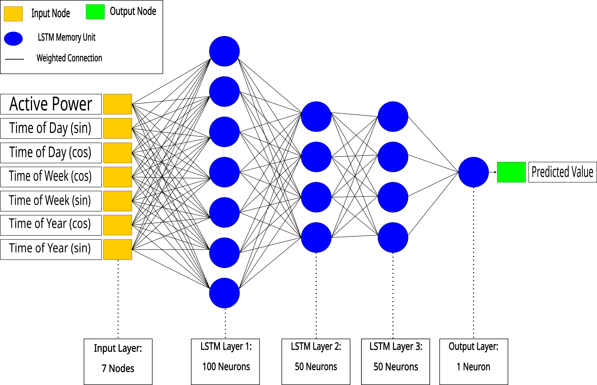

<!-- PROJECT SHIELDS -->
<!--
*** I'm using markdown "reference style" links for readability.
*** Reference links are enclosed in brackets [ ] instead of parentheses ( ).
*** See the bottom of this document for the declaration of the reference variables
*** for contributors-url, forks-url, etc. This is an optional, concise syntax you may use.
*** https://www.markdownguide.org/basic-syntax/#reference-style-links
-->
[![LinkedIn][linkedin-shield]][linkedin-url]

<!-- PROJECT LOGO -->
<br />
<div align="center">
  <a href="https://github.com/Kyppy/lstm_load_forecast">
    
  </a>
  
<h3 align="center">LSTM Time-series Electrical Load Prediction</h3>

  <p align="center">
    A long short-term memory (LSTM) time-series prediction model to forecast residential power consumption. The LSTM models are trained using electrical data measurements from a real home.
    <br />
    <br />
    <a href="https://github.com/Kyppy/lstm_load_forecast/issues/new?labels=bug&template=bug-report---.md">Report Bug</a>
    ·
    <a href="https://github.com/Kyppy/lstm_load_forecast/issues/new?labels=enhancement&template=feature-request---.md">Request Feature</a>
  </p>
</div>

<!-- TABLE OF CONTENTS -->
<details>
  <summary>Table of Contents</summary>
  <ol>
    <li>
      <a href="#about-the-project">About The Project</a>
      <ul>
        <li><a href="#built-with">Built With</a></li>
      </ul>
    </li>
    <li>
      <a href="#getting-started">Getting Started</a>
      <ul>
        <li><a href="#prerequisites">Prerequisites</a></li>
        <li><a href="#installation">Installation</a></li>
      </ul>
    </li>
    <li><a href="#usage">Usage</a></li>
    <li><a href="#roadmap">Roadmap</a></li>
    <li><a href="#license">License</a></li>
    <li><a href="#contact">Contact</a></li>
    <li><a href="#researchpublications">Research Publications</a></li>
  </ol>
</details>

<!-- ABOUT THE PROJECT -->
## About The Project

In this project a LSTM neural network is used to produce a time-series prediction model that forecasts residential power consumption. The models are trained on a <a href="https://archive.ics.uci.edu/dataset/235/individual+household+electric+power+consumption">publicly available</a> set of residential power measurements from a real home using a Tensorflow-Keras backend. The LSTM uses a 3-layer, stacked architecture.

<p align="right">(<a href="#readme-top">back to top</a>)</p>

### Built With

* [![Tensorflow][TF]][TF-url]
* [![Keras][KR]][KR-url]
  
<p align="right">(<a href="#readme-top">back to top</a>)</p>

<!-- GETTING STARTED -->
## Getting Started

To get a local copy of this project running follow these steps.

### Prerequisites

* Python
  ```python
  version 3.10.8
  ```

  ### Installation
  
1. Clone the repo
   ```sh
   git clone https://github.com/Kyppy/lstm_load_forecast.git
   ```
2. Install required packages
 * Using Pip
   ```sh
   pip install -r pip_requirements.txt
   ```
 * Using Conda
   ```sh
   conda install --yes --file conda_requirements.txt
   ```
3. Change git remote url to avoid accidental pushes to base project
   ```sh
   git remote set-url origin github_username/repo_name
   git remote -v # confirm the changes
   ```

<p align="right">(<a href="#readme-top">back to top</a>)</p>

<!-- USAGE EXAMPLES -->
## Usage

### Setting Hyperparameters
The LSTM hyperparameters can be easily edited by modifying the appropriate variables:

```python
batch_size = 32
epochs = 10
loss_metric = 'mae'
learning_rate = 0.0001
horizon_length = 1
window_size = 60 
```
The time units for `horizon_length` and `window_size` are assumed to be in minutes.

### Training Data
The dataset used to train this model was downloaded from <a href="https://archive.ics.uci.edu/dataset/235/individual+household+electric+power+consumption">here</a>. The dataset consists of minutely measurements over 3 years and 11 months, starting on December 2006 and ending on November 2010. The raw, unzipped, dataset text file is assumed to be stored in the default directory:
```python
data/raw/household_power_consumption.txt
```
The length of data used for training can be changed by selecting a reference date and modifying the `data_length` variable:
```python
# dd/mm/yy hh:mm:ss format
reference_date = '21/02/08 00:00:00'
data_length = 30
```
The `data_length` units are assumed to be in days. These settings will produce a dataset containing 30 days of measurements preceding the date of 21 Feb 2008.
Datasets can be generated using the `data.generate_training_data` function:
```python
data.generate_training_data(reference_date, data_length, sample_rate)
```
Datasets are saved upon successful generation. For repeated dataset settings, the existing/saved dataset is re-used not overwritten.

The time resolution of the generated dataset can be changed (e.g. from minutely to hourly sampling) by modifying the `sample_rate` variable:
```python
sample_rate = 60
```
The default `sample_rate` is 1 minute. A `sample_rate` of 60 would re-sample the dataset to use hourly time steps. The default unit for `sample_rate` is minutes.

<p align="right">(<a href="#readme-top">back to top</a>)</p>

### Training, Validation and Test Data
The generated dataset is partitioned into seperate `train`, `validation` and `test` subsets. The default ratio is 60% train, 20% validation and 20% test. The partition ratio can be changed by modifying the `train_portion`, `validation_portion` and `test_portion` params in the `partition_dataset` function.

### Train LSTM
The LSTM training is performed using the `train_lstm` function:
```python
train_lstm(training_dataset, window_size, horizon_length, data_length, sample_rate, loss_metric, batch_size, epochs)
```

### Model Assessment
The `assess_model` function determines the prediction model output error and compares the predicted values to the dataset labels.

<!-- ROADMAP -->
## Roadmap

- [ ] Add LSTM class for easier model modification
- [ ] Add `try-except` checks to reduce code fragility
- [ ] Enable simultaneous, multiple data parameter changes
- [ ] Add demo mode 

<p align="right">(<a href="#readme-top">back to top</a>)</p>

<!-- LICENSE -->
## License

Distributed under the MIT License. See `LICENSE` for more information.

<p align="right">(<a href="#readme-top">back to top</a>)</p>

<!-- CONTACT -->
## Contact

Kyppy Smani - simanikyppy@gmail.com

Project Link: [https://github.com/Kyppy/lstm_load_forecast](https://github.com/Kyppy/lstm_load_forecast)

<p align="right">(<a href="#readme-top">back to top</a>)</p>

<!-- RESEARCH PUBLICATIONS -->
## Research Publications

The following peer-reviewed research papers were published with findings produced using code from this project.

* [“Using LSTM To Perform Load Modelling For Residential
Demand Side Management”](https://ieeexplore.ieee.org/document/10057875)
* [“Using LSTM To Perform Load Predictions For Grid-
Interactive Buildings”](https://www.researchgate.net/publication/381076004_Using_LSTM_to_Perform_Load_Predictions_for_Grid-Interactive_Buildings)

<p align="right">(<a href="#readme-top">back to top</a>)</p>

<!-- MARKDOWN LINKS & IMAGES -->
<!-- https://www.markdownguide.org/basic-syntax/#reference-style-links -->
[KR]: https://img.shields.io/badge/Keras-%23D00000.svg?style=for-the-badge&logo=Keras&logoColor=white
[KR-url]: https://keras.io/
[license-shield]: https://img.shields.io/github/license/Kyppy/lstm_load_forecast.svg?style=for-the-badge
[license-url]: https://github.com/Kyppy/lstm_load_forecast/blob/main/LICENSE
[linkedin-shield]: https://img.shields.io/badge/-LinkedIn-black.svg?style=for-the-badge&logo=linkedin&colorB=555
[linkedin-url]: https://linkedin.com/in/kyppysimani
[TF]: https://img.shields.io/badge/TensorFlow-%23FF6F00.svg?style=for-the-badge&logo=TensorFlow&logoColor=white
[TF-url]: https://www.tensorflow.org/
